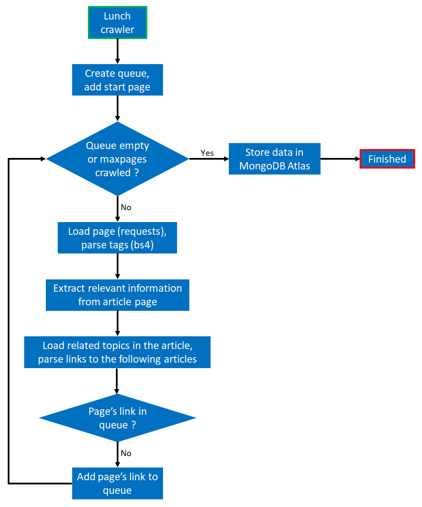
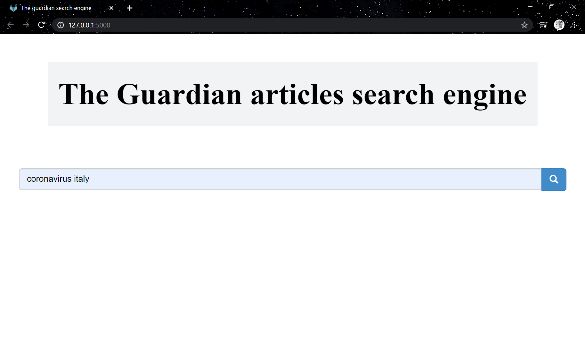
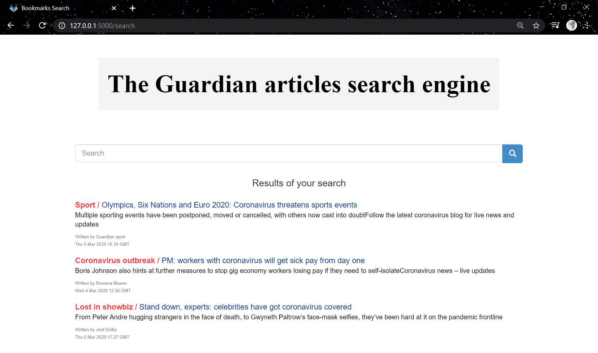

# the_guardian_crawler
___
## Crawler
___
### *Description*

An easy-to-use news crawler that extract structured information from the [The Guardian International Edition](https://www.theguardian.com/international) web site. This crawler combine the power of Python libraires such as [`requests`](https://requests.readthedocs.io/en/master/) for making HTTP requests and [`BeautifulSoup (bs4)`](https://pypi.org/project/beautifulsoup4/) for parsing HTML.

The structured information scraped from the articles are stored in the hosted Mongo database [MongoDB Atlas](https://www.mongodb.com/cloud/atlas). The structured information includes ```Title```, ```Link```, ```Topic```, ```Authors```, ```Datetime```, ```Description```, ```Text``` and ```Related topics links```.

Before submmiting data to MongoDB, we are going to clean up the scraped text to use it later in the search engine, using the libraries  [`spaCy`](https://spacy.io/) and [`NLTK`](https://www.nltk.org/).

### *Run the crawler*
Before running the crawler, make sure to connect your MongoDB Atlas with this python application:
* To learn how to generate a URI connection strings please visit this [`link`](https://docs.atlas.mongodb.com/driver-connection/)
* Insert this key in the 'parameters.yaml' file in the 'url_connection' variable
* [`Create a database and a collection`](https://docs.atlas.mongodb.com/data-explorer/databases-collections/) and indicate their names in the 'parameters.yaml' file

To use the crawler, simply run:
* ```git clone https://github.com/mcmxlix/the_guardian_crawler.git```
* ```cd the_guardian_crawler/Crawler```
* ```pip install -r requirements.txt```
* ```python __main__.py```

### *How does the crawler work ?*


___
## Search-engine
___
### *Description*
A search engine API capable to connect to MongoDB Atlas and collects the crawled data. When searching with keywords, the engine will compare this keywords with the data of each article, more precisely we will use the "clean_text", and retrieve a list of informations matching the query, sorted by relevance.

```TF-IDF``` is the algorithm used for the ranking of the pages. TF is Term frequency which calculates the total occurrence of the word divided by the total words. IDF is the inverse document frequency which gives the rareness of the word among all the documents 
```
TF = (Total occurance of the word in the document)/(Total words in the document)
```
```
IDF = log⁡((Total Documents)/(Total number of documents the word is present))
```
```
TF-IDF = TF×IDF
```

### *Run the search engine*
the following command lines are the continuation of the previous commands:
* ```cd ../Search_engine```
* ```python app.py```

### *Search engine screenshots*

